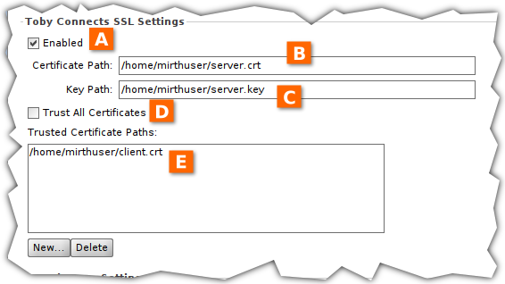

# Toby Connects SSL Plugin

This plugin enables SSL in Mirth Connect 4.0.1 TCP connectors.

## Manual

**Disclaimer:** This plugin's developer is neither an SSL/TLS expert nor a Mirth Connect development pro. They lack the resources to thoroughly test their plugin and do not recommend its usage in production environments.

### Installation

In Mirth Connect Administrator, install *tcssl.zip*.

### Usage

X509 certificates and PKCS8 private key (decrypted) shall be stored in PEM files accessible to the Mirth Connect service user. They are only read once on channel deployment. Currently, only a single certificate per file is supported.

Currently, Respond on New Connection (in any case) is not supported. Client mode for TCP listeners and server mode for TCP senders have yet to be tested.

| Item | Name | Description |
|---|---|---|
|A|Enabled|Enable or disable SSL support.|
|B|Certificate Path|Path to X509 certificate PEM file.|
|C|Key Path|Path to PKCS8 private key PEM file. Not used in client mode.|
|D|Trust All Certificates|Whether to trust *all* certificates from connected sockets. In server mode, unchecking this option calls for client authentication.| 
|E|Trusted Certificate Paths|Paths to PEM files of trusted X509 certificates. An empty list *and* not trusting *all* certificates allow for *no* connection.|

## Development

### Dependencies

- Copy dependencies from Mirth Connect installation to */lib/*
  - from *Mirth Connect/server-lib/*
    - *mirth-server.jar*
    - *donkey-server.jar*
  - from *Mirth Connect/client-lib/*
    - *donkey-model.jar*
    - *mirth-client.jar*
  - from *Mirth Connect/extensions/tcp/*
    - *tcp-shared.jar*
    - *tcp-server.jar*
- Additionally download to */lib/*
  - *log4j-1.2.16.jar*
  - *commons-lang3-3.9.jar*
  - *miglayout-core-4.2.jar*
  - *miglayout-swing-4.2.jar*
  - *xstream-1.4.12.jar*

This plugin is developed in OpenJDK 11 on Linux.

### Compile And Package

Make sure dependencies are satisfied.

In */*, to create *build/tcssl.zip*, execute: `ant -DsignAlias=<alias> -DsignPass=<password>`

Parameters `signAlias` and `signPass` are needed to sign the JAR with a certificate from the default key store. Self-signed archives can be used in Mirth Adminstrator Launcher when run with argumens `-d` and/or `-k`.

### Testing Procedure

Before releasing a new version of this plugin the following tests must have been passed.

*/testhelp/* has client/server certificates/keys and Python programs to help testing.

#### TCP Listener (Server Mode)

No procedure defined yet.

|Step|Client SSL|Client Cert|Listener SSL|Listener Cert|Listener Trust|Expected|
|---|---|---|---|---|---|---|
|1|No||No|||Success|
|2|No||Yes|server|All|Failure|
|3|Yes|-|Yes|server|All|Success|
|4|Yes|-|Yes|server|None|Failure|
|5|Yes|-|Yes|server|client|Failure|
|6|Yes|client|Yes|server|client|Success|

#### TCP Listener (Client Mode)

No procedure defined yet.

#### TCP Sender (Client Mode)

|Step|Sender SSL|Sender Cert|Sender Trust|Server SSL|Server Cert|Server Trust|Expected|
|---|---|---|---|---|---|---|---|
|1|No|||No|||Success|
|2|Yes|client|All|No|||Failure|
|3|Yes|client|All|Yes|server|All|Success|
|4|Yes|client|None|Yes|server|All|Failure|
|5|Yes|client|server|Yes|server|All|Success|
|6|Yes|client|All|Yes|server|client|Success|

#### TCP Sender (Sever Mode)

No procedure defined yet.

### To Do

- TCP Listener
  - Test Client Mode
  - Respond on New Connection
- TCP Sender
  - Test Server Mode
- General
  - Certificate Validation
  - Mirth Connect Administrator Command to Clear "Certificate & Key Store"
  - Allow PKCS8 Encrypted Private Key
  - [Allow Other Private Keys](https://github.com/openssl/openssl/blob/master/include/openssl/pem.h#L35)

### Version History

#### v0.3.0

- Unlocked SSL settings for TCP listener/sender in both server and client mode each.

#### v0.2.0

- TCP listener in server mode may require client authentication.

#### v0.1.0

- TCP listener in server mode works
