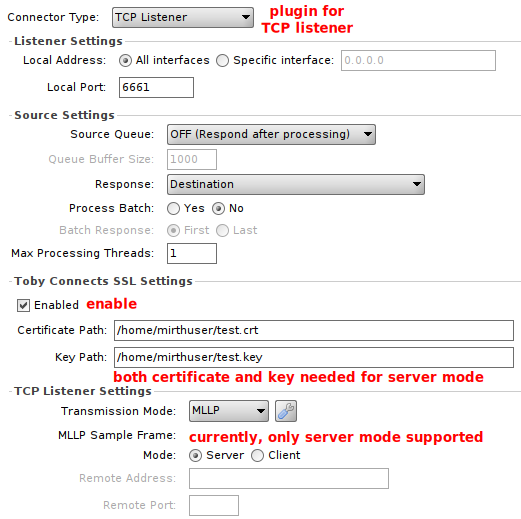

# Toby Connects SSL Plugin

This plugin enables SSL in Mirth Connect 4.0.1 TCP connectors.

## Manual

**Disclaimer:** This plugin's developer is neither an SSL/TLS expert nor a Mirth Connect development pro. They lack the resources to thoroughly test their plugin and do not recommend its usage in production environments.

### Installation

In Mirth Connect Administrator, install *tcssl.zip*.

### Usage

X509 certificates and PKCS8 private key (decrypted) shall be stored in PEM files accessible to the Mirth Connect service user. They are read once on channel deployment. Currently, only a single certificate per file is supported.

Currently, only the TCP listener in server mode is supported.

## Development

### Dependencies

- Copy dependencies from Mirth Connect installation to */lib/*
  - from *Mirth Connect/server-lib/*
    - *mirth-server.jar*
    - *donkey-server.jar*
  - from *Mirth Connect/client-lib/*
    - *donkey-model.jar*
    - *mirth-client.jar*
  - from *Mirth Connect/extensions/tcp/*
    - *tcp-shared.jar*
    - *tcp-server.jar*
- Additionally download to */lib/*
  - *log4j-1.2.16.jar*
  - *commons-lang3-3.9.jar*
  - *miglayout-core-4.2.jar*
  - *miglayout-swing-4.2.jar*
  - *xstream-1.4.12.jar*

This plugin is developed in OpenJDK 11 on Linux.

### Compile And Package

Make sure dependencies are satisfied.

In */*, to create *tcssl.zip*, execute: `ant -DsignAlias=<alias> -DsignPass=<password>`

The parameters are needed to sign the JAR. Self-signed archives can be used in Mirth Adminstrator Launcher when run with argumens `-d` and/or `-k`.

### To Do

- TCP Listener
  - Server Mode
    - Client Certificate Trust
  - Client Mode
- TCP Sender
  - Client Mode
  - Server Mode
- General
  - Disable Mirth Connect Administrator Fields on SSL Disabled
  - Mirth Connect Administrator Command to Clear "Certificate & Key Store"
  - Allow PKCS8 Encrypted Private Key
  - [Allow Other Private Keys](https://github.com/openssl/openssl/blob/master/include/openssl/pem.h#L35)

### Version History

#### v0.1

- TCP listener in server mode works
